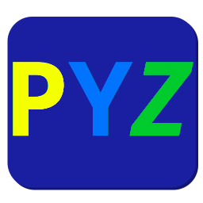

# PyZ - A custom shell for Python, written in Python

- - -

PyZ is meant to be a custom shell for python. Contains a customizable shell, a .rc file and perhaps more coming soon! The shell's main inspiration is zsh, an alternative shell to bash. Except instead of being an entire different programming language, it's an alternative shell!

<h2> HEADS UP: This thing is still in beta!! </h2>

- [PyZ - A custom shell for Python, written in Python](#pyz---a-custom-shell-for-python-written-in-python)
  - [Platform support](#platform-support)
  - [Installation](#installation)
    - [Requirements](#requirements)
  - [Usage](#usage)
    - [Running the shell](#running-the-shell)
  - [Customization](#customization)
    - [.pyzrc file](#pyzrc-file)
    - [Prompt themes](#prompt-themes)
  - [Currently known bugs](#currently-known-bugs)
  - [To-do list](#to-do-list)

## Platform support

This being a Python app, it's able to work on basically anything that can run a python intrepreter. So

- Windows
- MacOS
- Linux
- Free/OpenBSD

and probably many more.

## Installation

- Clone the repository

```bash
git clone https://github.com/CodyMarkix/PyZ-Shell
```

- Then enter the cloned git repository and run the install script.

```bash
cd PyZ-shell && ./make install
```
<sub> If you're on Windows, replace `./make install` with `.\make install`</sub>

### Requirements

- Tested with Python 3.8.x
- Termcolor
- Pyinstaller (for creating a binary!)
- AppImageTool (for creating an AppImage!)

## Usage

### Running the shell
- There's two ways to run the shell.

1. Open up a terminal and run `pyz`.
2. If you downloaded the AppImage and used something like AppImageLauncher to register it into your DE's menu, open that menu and click on "PyZ".

## Customization

### .pyzrc file
This is where a lot of the magic happens, customization-wise. In the default .rc file, there's a prompt decleration and some notes. You'll want to keep some sort of prompt.

By default, PyZ uses the Termcolor module, which is hard-imported, along with some others in the standard modules. But you can add whatever prompts you want.

### Prompt themes

As you may notice, the .pyzrc file is basically a script that is went through and is executed line-by-line when an instance of the shell is opened. Meaning you can have various prompts. Some examples include:

Bourpy (default):
```python
global prompt; prompt = "[ "+ termcolor.colored(os.getcwd(), "green") + " ]"+ termcolor.colored(" >", "blue")
```
Which produces:


Classic:
```python
global prompt; prompt = "PyZ >>>"
```
Which produces:


## Currently known bugs

- Nested multi-line code is not supported

## To-do list

- [x] Complete make.ps1
- [x] Fix building from source
- [x] Fix multi-line code bug